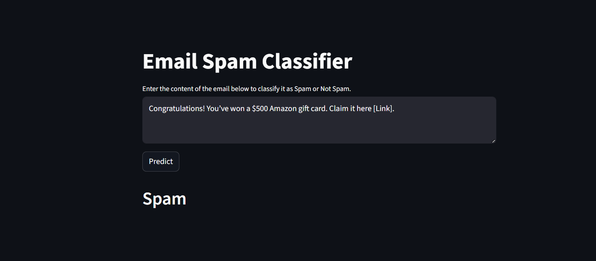

# 📧 Email Spam Classifier (Python + ML)
[](https://monish-email-spam-classifier.streamlit.app)  


This project classifies emails/SMS messages as **Spam** or **Not Spam** using Natural Language Processing (NLP) and Machine Learning. The model is deployed with an **interactive Streamlit web app**.

---

## 🚀 Features
- 📝 Text preprocessing (lowercasing, stopword removal, stemming, punctuation removal)  
- 🔡 TF-IDF vectorization for converting text into numerical features  
- 🤖 Spam detection using **Multinomial Naive Bayes**  
- 🌐 Interactive **Streamlit app** for real-time predictions  

---

## 🛠️ Tech Stack
- **Python**  
- **Pandas, NumPy**  
- **Scikit-learn**  
- **NLTK**  
- **Streamlit**  
- **Pickle** (for saving vectorizer & model)  

---

## ⚙️ Installation & Setup
1. Clone the repository:
   ```bash
   git clone https://github.com/monish1716/Email-Spam-Classifier.git
   cd Email-Spam-Classifier
   
2. Install dependencies:
   pip install -r requirements.txt
   
3. Run the Streamlit app:
   
   streamlit run app.py

---

## Dataset
This project uses the SMS Spam Collection Dataset.
It contains two categories:

ham → non-spam messages

spam → unwanted/advertisement messages

Download them from [Kaggle](https://www.kaggle.com/datasets/uciml/sms-spam-collection-dataset).

---

## 🎯 How It Works
 
1️⃣ Preprocess text (tokenization, stemming, removing stopwords/punctuation)
2️⃣ Convert text to vectors using TF-IDF
3️⃣ Train model (Multinomial Naive Bayes)
4️⃣ Save model.pkl & vectorizer.pkl
5️⃣ Deploy model with Streamlit for live predictions

---

## 🌐 Demo

After running the Streamlit app:
- Enter an email/SMS in the text box
- Click Predict
- Instantly get classification: Spam 🚨 or Not Spam ✅

---

## 📌 Example  
Here’s how the app looks in action:  

  

---

## 🔮 Future Improvements  
- [ ] Add more classifiers (Logistic Regression, Random Forest, SVM) 
- [ ] Implement deep learning (LSTM/Transformers) for improved accuracy
- [ ] Enhance explainability (word clouds, SHAP/LIME for feature importance)

---

## 🤝 Contributing

Pull requests are welcome.
For major changes, please open an issue first to discuss what you’d like to change
